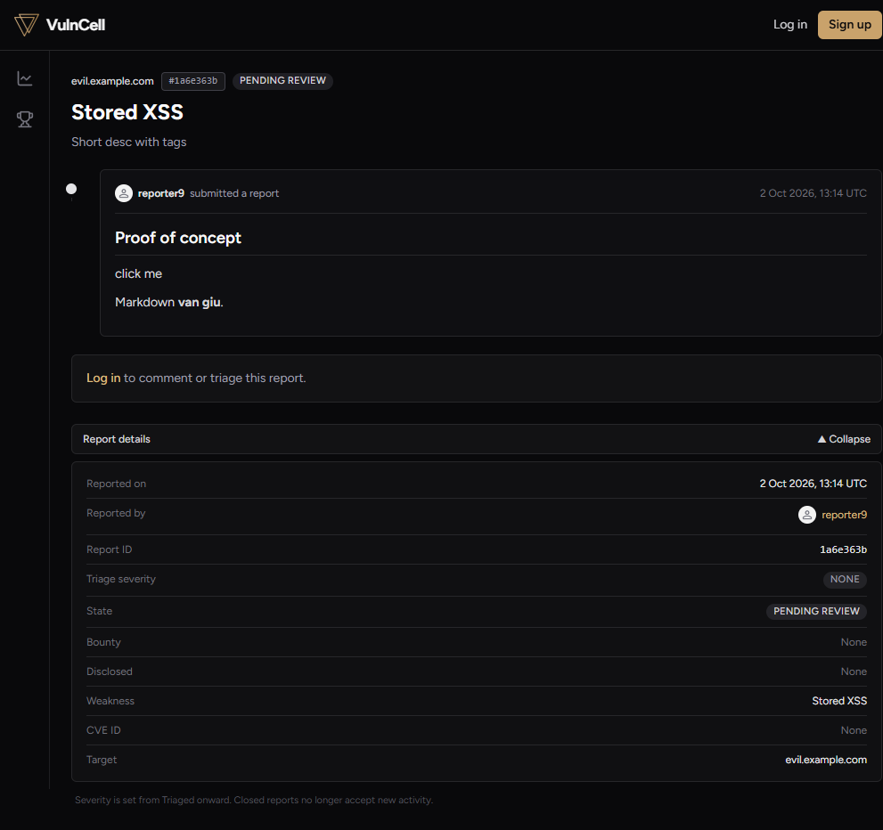
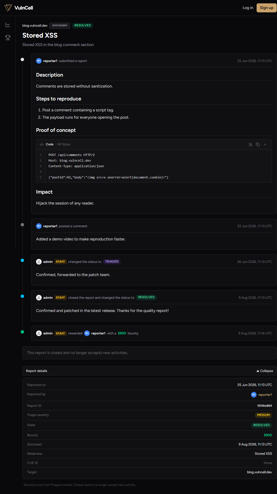

# Lộ trình đọc hiểu sâu logic VulnCell

> **Mục đích:** tổng hợp toàn bộ kiến thức logic của hệ thống; code được **comment trực tiếp bằng ngôn ngữ dễ hiểu** ở từng file.
> **Cách dùng:** đi tuần tự: **Nền tảng (A)** → **Chặng 1 → 7** → **Phụ lục**. Mỗi mục có "Câu hỏi kiểm tra" — trả lời được mới đi tiếp.
> Không cần sửa logic, chỉ đọc + chạy thử theo ví dụ.

## Mục lục

**Phần A — Nền tảng**
- A1. Node.js, npm và cách project được chạy
- A2. Migration & seed là gì
- A3. Postgres và Redis — kho chính vs nhớ tạm
- A4. Index & drift — "mục lục" của database

**Chặng 1 — Một request đi qua backend** (5 trạm)
- Bản đồ tổng quan
- Trạm 1: `server.js` — khởi động
- Trạm 2: `app.js` — lắp ráp middleware
- Trạm 3: `routes/auth.js` — đăng ký / đăng nhập / cookie / JWT
- Trạm 4: `middleware/auth.js` — trạm gác
- Trạm 5: Xử lý lỗi — `validate.js` + `HttpError` + error handler
- Tổng kết Chặng 1

**Chặng 2 — Mô hình dữ liệu** (`backend/prisma/schema.prisma`)
- 1. Bốn bảng và quan hệ
- 1b. Khóa chính / khóa ngoại — "link" giữa các bảng
- 2. Enum — danh sách giá trị cố định
- 3. Reputation vs ReputationLedger
- 4. Vì sao `ReportEvent` tách riêng
- 5. Index trong dự án

**Chặng 3 — State machine** (`services/stateMachine.js` + `routes/reports.js`)
- 1. Hai file, hai vai trò · 2. Bảng chuyển 8 trạng thái · 3. Điểm theo trạng thái · 4. Luật severity & bounty · 5. Phân quyền · 6. Một action sinh ra gì · 7. Kết quả thật

**Chặng 4 — Reputation / Signal / quota** (`services/reputation.js`)
- 1. Hai con số, cùng một nguồn · 2. Vì sao cần cả hai · 3. Quota theo Signal · 4. Cột `reputation` có khớp ledger? · 5. Kết quả thật

**Chặng 5 — Rate limit 3 lớp & cache** (`middleware/rateLimit.js`, `src/redis.js`)
- 1. Ba lớp bảo vệ · 2. Vì sao fail-open · 3. Cache & cơ chế "version" · 4. Kết quả thật · 5. `trust proxy`

**Chặng 6 — Frontend** (`App.jsx`, `AuthContext`, `api/client.js`, sanitize, Markdown, search)
- 1. Bức tranh tổng thể · 1b. Cơ chế luồng trang (routing) · 2. Gọi API · 3. Đăng nhập · 4. Sanitize 2 tầng · 5. Markdown & CodeBlock · 6. Cú pháp tìm kiếm · 6b. Cơ chế tìm kiếm (từ ô search tới Postgres) · 7. Privacy SPAM

**Chặng 7 — Kiểm chứng: smoke test, seed & benchmark**
- 1. Smoke test · 2. Seed · 3. Seed benchmark · 4. Benchmark k6 · 5. Bảng kết quả · 6. Cách đọc bảng

**Phụ lục — Chạy & deploy (dev vs demo container)**

**Checklist ôn thi** — 8 câu hỏi lớn

---

# PHẦN A — NỀN TẢNG

## A1. Node.js, npm và cách project được chạy

| Từ | Hiểu đơn giản |
|---|---|
| **Node.js** | Chương trình để chạy JavaScript **ngoài trình duyệt**. Backend VulnCell chạy bằng Node. |
| **Thư viện (package)** | Code người khác viết sẵn để dùng lại: `express` (làm web server), `prisma` (làm việc với database)… |
| **npm** | "Chợ ứng dụng" của Node. `npm install` = **tải các thư viện** project cần về máy. |
| **`node_modules/`** | Cái **kho** chứa thư viện đã tải. Rất nặng → không đưa lên GitHub (đã `.gitignore`). |
| **`package.json`** | **Bản danh sách** của project: cần thư viện nào + các **lệnh tắt**. |
| **`npm run <tên>`** | Chạy một "lệnh tắt" ghi trong `package.json`. |
| **`npx <tên>`** | Chạy công cụ mà không cần cài cố định (ví dụ `npx prisma migrate dev`). |
| **nodemon** | Công cụ **tự khởi động lại server mỗi khi sửa file** (auto-reload). |

Dòng chảy khi gõ `npm run dev` (lệnh nằm trong `package.json` gốc):

```
npm run dev (gốc)              → concurrently: chạy song song backend + frontend
  → npm --prefix backend run dev   → lệnh "dev" của backend = "nodemon src/server.js"
    → nodemon src/server.js        → nodemon chạy file… và tự restart khi bạn sửa file
      → node src/server.js         ← ĐÂY mới là "server" thật sự bắt đầu
```

## A2. Migration & seed là gì

- **Database (Postgres)** lưu dữ liệu thật theo **bảng** (như file Excel): bảng `User`, bảng `Report`…
- Bạn mô tả *muốn bảng có cột gì* trong `backend/prisma/schema.prisma`. Nhưng Postgres **không tự đọc** file này.
- **Migration = file ghi lại *một thay đổi cấu trúc database*** (ví dụ "tạo bảng User", "thêm cột avatar"), viết bằng SQL. Chạy migration = **áp các thay đổi đó vào database thật**.

| Lệnh | Dùng ở đâu | Làm gì |
|---|---|---|
| `prisma migrate dev` | Máy dev | So schema với DB → **tạo file migration mới** → áp vào DB (có thể hỏi han) |
| `prisma migrate deploy` | Container demo / máy chủ | **Chỉ đọc migration đã có sẵn** và áp lần lượt (không tạo mới, không hỏi) |

- **Seed** là chuyện khác: sau khi có bảng rỗng, `npm run seed` chạy `backend/prisma/seed.js` để **đổ dữ liệu mẫu** (11 tài khoản + 100 report) cho đẹp để demo.

## A3. Postgres và Redis — kho chính vs nhớ tạm

| | Postgres | Redis |
|---|---|---|
| Vai trò | **Kho hàng chính** — lưu lâu dài, là nguồn sự thật | **Nhớ tạm siêu nhanh** (trong RAM) |
| Dữ liệu | User, Report, sổ điểm… | Cache kết quả tính toán + bộ đếm (đăng nhập sai, số lượt nộp) |
| Nếu "chết" | Không thể chạy (phải có) | Server **vẫn chạy**: đọc thẳng Postgres, rate limit cho qua (fail-open) |

## A4. Index & drift — "mục lục" của database

> Migration là gì / 2 lệnh migrate đã nói ở **A2**; phần này tập trung vào **index** (thứ quyết định tốc độ truy vấn) và **drift** (vì sao index có thể biến mất).

**Index = "mục lục" của database.** Không có index, muốn tìm 1 dòng DB phải **đọc từng trang** (sequential scan). Có index, DB tra mục lục để nhảy thẳng tới dòng cần — nhanh hơn rất nhiều khi bảng lớn. Đổi lại: index tốn chỗ và làm thao tác ghi chậm hơn chút.

| Loại index | Dùng cho | Ví dụ trong repo |
|---|---|---|
| B-tree (mặc định) | So sánh bằng, khoảng, sắp xếp | `state`, `createdAt`, `[userId, createdAt]` |
| **Composite** (nhiều cột) | Vừa lọc theo cột đầu, vừa sắp theo cột sau → **bỏ bước Sort** | `(state, createdAt)` |
| **GIN + pg_trgm** | Tìm kiếm text kiểu `ILIKE '%abc%'` | `Report_target_trgm_idx`, … |

- **Composite index**: tra theo cột đầu **rồi** đã xếp sẵn theo cột sau. Query `WHERE state='PENDING' ORDER BY createdAt DESC` không phải lọc xong sắp lại nữa.
- **pg_trgm / GIN**: `pg_trgm` cắt chuỗi thành các cụm 3 ký tự ("trigram"), `GIN` là loại index tra các cụm đó. Nhờ vậy `ILIKE '%api%'` (tìm chuỗi con) **mới dùng được index** — index B-tree thường không làm được, nên thiếu nó thì tìm kiếm = quét cả bảng.
- **Vì sao giúp benchmark**: k6 chạy cùng truy vấn trên dataset lớn rồi ghi p95/thời gian; có index thì kế hoạch đổi từ "quét toàn bảng" sang "tra index" → nhanh hơn nhiều ở quy mô lớn. (Với 100 report của bản demo, Postgres còn thấy quét cả bảng rẻ hơn nên chưa dùng index — **bình thường**: index chỉ đáng giá khi bảng đủ lớn.)

**Vì sao index (hay bảng) có thể tự dưng "biến mất"? (drift)** — Prisma coi `schema.prisma` là **nguồn sự thật về cấu trúc DB**. Nếu ai đó tạo index/bảng **bằng SQL tay** mà **không khai báo** trong schema, thì lần `prisma migrate dev` kế tiếp Prisma so schema ↔ DB, thấy "DB có thứ mà schema không biết" → coi là **drift** và sinh migration **DROP** nó. Vì vậy mọi thứ muốn tồn tại lâu dài **phải khai báo trong `schema.prisma`** (composite: `@@index([a, b])`; GIN trigram: `type: Gin` + `ops: raw("gin_trgm_ops")`).

**Cách TỰ KIỂM TRA một index thuộc loại nào:**
- Ở `schema.prisma`: dòng `@@index(...)` có `type: Gin` + `ops: raw("gin_trgm_ops")` → **GIN trgm**; chỉ `@@index([a, b])` → **composite B-tree**.
- Ở file migration SQL hoặc `psql`: `CREATE INDEX ... USING gin (... gin_trgm_ops)` → GIN trgm; `USING btree (...)` → B-tree.
- Query nhanh: `SELECT indexname FROM pg_indexes WHERE tablename='Report' AND indexdef ILIKE '%gin%';` → đúng 3 index trgm. Hoặc hỏi catalog `pg_am.amname` (trả về `btree`/`gin`).
- Prisma Studio **không** hiện loại index (chỉ hiện dữ liệu) — muốn xem trực quan thì dùng DBeaver (node **Indexes**).

---

# CHẶNG 1 — MỘT REQUEST ĐI QUA BACKEND

> Chặng 1 gồm **5 trạm**, đi lần lượt: khởi động → lắp ráp middleware → auth → trạm gác → xử lý lỗi.

## Bản đồ tổng quan

```
Browser (fetch '/api/...' , credentials: 'include')
   │
   │  (dev) Vite proxy :5173 ──► :4000
   ▼
Express — app.js, theo ĐÚNG thứ tự đăng ký:
   1. cors           → cho phép origin frontend + gửi cookie
   2. compression    → nén gzip response
   3. express.json   → parse body JSON (tối đa 1mb)
   4. cookieParser   → biến header "Cookie" thành req.cookies
   5. morgan         → log request ra terminal
   6. GET /health    → healthcheck (đặt trước rate limit)
   7. apiRateLimit   → chặn theo IP cho MỌI /api
   8. routes:  /api/auth | /api/reports | /api/leaderboard | /api/users
        └─ middleware con (validate, authenticate…) → handler → Prisma/Redis
   9. 404 handler cho /api
  10. error handler (4 tham số) — nơi mọi lỗi đổ về
   ▼
JSON response  { ... }  hoặc  { "error": "..." }
```

## Trạm 1 — `backend/src/server.js`: khởi động

File này là **điểm khởi đầu**, chạy đầu tiên. Nó chỉ làm 4 việc:

```js
require('dotenv').config();                   // (1) đọc "sổ cấu hình" .env
const app = require('./app');                 // (2) lấy "bộ khung web" đã lắp ở app.js
const { connectRedis } = require('./redis');  // (3) lấy hàm nối Redis
const PORT = process.env.PORT || 4000;        // (4) chọn cổng
connectRedis();                               //     nối Redis — KHÔNG đứng chờ
app.listen(PORT, () => { ... }).on('error', ...); //  mở cổng, nhận request
```

### Bảng dịch cú pháp (JS → tiếng người)

| Cú pháp | Nghĩa |
|---|---|
| `require('dotenv')` | "Mượn thư viện dotenv" (chuyên đọc file `.env`). |
| `const ten = ...` | Tạo biến tên `ten`, **không đổi giá trị** về sau. |
| `process.env.PORT` | Đọc thông số `PORT` từ môi trường (đã nạp từ `.env`). |
| `a \|\| b` | "Nếu `a` không có thì lấy `b`" → không có PORT thì dùng 4000. |
| `() => { }` | Một **hàm** viết ngắn. |
| `` `...${PORT}...` `` | Chuỗi có **chèn giá trị biến**. |
| `.on('error', fn)` | "Hễ có sự kiện `error` thì gọi hàm `fn`". |
| `process.exit(1)` | Thoát chương trình, mã 1 = "thoát vì có lỗi". |
| `throw err` | Ném lỗi ra ngoài (chương trình dừng và in lỗi). |
| `module.exports = app` | "Xuất" `app` cho file khác `require` (câu cuối của `app.js`). |

### `.env` chứa những gì?

`.env` là **file cấu hình bí mật** — không đưa lên GitHub (có bản mẫu `.env.example`).

| Thông số | Nghĩa dễ hiểu |
|---|---|
| `DATABASE_URL` | **Địa chỉ + tài khoản** kết nối Postgres: `postgresql://user:pass@địa-chỉ:5432/tên-db` |
| `JWT_SECRET` | **Chìa khoá bí mật** để "ký" thẻ đăng nhập (token). Lộ chìa = làm giả thẻ được. |
| `PORT` | **Số cổng** server mở (4000). |
| `FRONTEND_URL` | Địa chỉ frontend (`http://localhost:5173`) — dùng cho CORS. |
| `REDIS_URL` | Địa chỉ Redis (`redis://localhost:6379`). |
| `RATE_LIMIT_DISABLED` | `true` = tắt giới hạn gọi API (chỉ dùng khi chạy bài đo tải). |
| `CACHE_DISABLED` | `true` = tắt cache (dùng để đo tốc độ baseline). |
| `RATE_LIMIT_API_MAX` / `RATE_LIMIT_API_WINDOW` | Chống spam: tối đa 300 lần gọi / 60 giây / 1 IP. |
| `COOKIE_SECURE` | `true` = chỉ gửi cookie qua HTTPS (khi deploy thật). |
| `COOKIE_NAME` | Tên cookie phiên (mặc định `token`; demo dùng `vc_demo_token`). |

`require('dotenv').config()` chính là dòng **đọc `.env` rồi nhét các giá trị vào bộ nhớ**, để code lấy ra bằng `process.env.TÊN`.

### Redis: nối thế nào và "khi Redis chết" thì sao?

- Redis dùng làm **cache** (nhớ tạm kết quả vừa tính) và **bộ đếm** (đăng nhập sai, số lượt nộp/ngày).
- Redis chết → `cacheGet` trả `null` → code **đọc thẳng Postgres** (chậm hơn nhưng vẫn đúng); rate limit **fail-open** = "thà cho qua, còn hơn chặn nhầm người dùng khi hệ thống phụ trợ chết".
- **Vì sao không `await`?** `await` = "đứng đợi việc này xong mới làm tiếp". Thư viện Redis thử kết nối lại **mãi mãi**, nên Redis chết thì "đợi" không bao giờ xong → server sẽ **không bao giờ mở cổng**. Vì vậy người viết cố ý **không đợi**: thử nối ở phía sau, server cứ mở cổng và chạy.

> **Tóm lại:** server sống độc lập với Redis — có Redis thì nhanh hơn, không có vẫn chạy.

### Đoạn cuối — kiểm tra "server khác đang chạy"

- **Cổng (port)** giống **số kênh** đài phát thanh: chỉ **1 chương trình** được dùng **1 cổng** tại một thời điểm.
- Server cũ còn chạy (còn giữ cổng 4000) → server mới mở cổng sẽ lỗi `EADDRINUSE` ("địa chỉ đang được dùng").
- Code **bắt đúng lỗi này** và in hướng dẫn: Ctrl+C cửa sổ cũ, hoặc `npm run kill:api` (lệnh trong `package.json`: tìm tiến trình đang giữ cổng 4000 rồi tắt).

### Câu hỏi kiểm tra
1. Vì sao `connectRedis()` không `await`? → Vì Redis retry vô hạn; await sẽ treo server khi Redis chết.
2. `.env` lấy từ đâu vào `process.env`? → `require('dotenv').config()` đọc file `.env`.
3. `EADDRINUSE` nghĩa là gì và xử lý ra sao? → Cổng bị server cũ chiếm; Ctrl+C server cũ hoặc `npm run kill:api`.

---

## Trạm 2 — `backend/src/app.js`: lắp ráp middleware

Ý tưởng: **mỗi request là một vị khách vào quán**, đi lần lượt qua các **"cửa"** đăng ký bằng `app.use(...)`. Cửa nào đăng ký trước thì chạy trước và có quyền **chặn khách**.

| Cửa | Code | Nhiệm vụ đời thường |
|---|---|---|
| 1 | `cors({ origin, credentials })` | "Website nào được phép gọi API?" + cho gửi kèm cookie |
| 2 | `compression()` | Nén dữ liệu trả về cho nhẹ |
| 3 | `express.json({ limit: '1mb' })` | Đọc "giỏ hàng" JSON khách gửi lên; chặn nếu quá to |
| 4 | `cookieParser()` | Đọc "thẻ thành viên" (cookie) đính kèm → `req.cookies` |
| 5 | `morgan('dev')` | Ghi log mỗi request ra terminal |
| — | `GET /health` | Đường kiểm tra server còn sống (`{"ok":true}`) |
| 6 | `apiRateLimit` | Chặn nếu 1 IP gọi quá nhiều lần |
| — | 4 nhóm `routes` | Các "phòng chức năng": auth / reports / leaderboard / users |
| — | 404 handler | Không khớp phòng nào → báo "không tìm thấy" |
| — | error handler | "Phòng quản lý" hứng mọi lỗi |

> **Thêm ở production:** `app.set('trust proxy', 1)` — xem Chặng 5, mục 5.

Cú pháp cần biết:

| Cú pháp | Nghĩa |
|---|---|
| `app.use(x)` | "Mọi request hãy đi qua `x`." |
| `app.get('/health', fn)` | Khi có khách gõ **GET** đường `/health` thì gọi `fn`. |
| `req` / `res` | `req` = yêu cầu khách gửi; `res` = câu trả lời mình gửi về. |
| `res.json({ ok: true })` | Trả dữ liệu dạng JSON. |
| `res.status(404).json(...)` | Trả về **mã 404** kèm JSON. |
| `(err, req, res, next) => {}` | Hàm **xử lý lỗi** — Express nhận diện nhờ đúng **4 tham số**. |

**Mã trạng thái hay gặp:** 200 thành công · 400 dữ liệu gửi lên sai · 401 chưa đăng nhập · 403 không có quyền · 404 không tìm thấy · 429 gọi quá nhiều · 500 lỗi server.

**Vì sao thứ tự lại như vậy?**
- `/health` đặt **trước** `apiRateLimit` → healthcheck của Docker không bao giờ bị chặn 429.
- `routes` đặt **trước** 404 → 404 chỉ chạy khi không phòng nào khớp.
- **Error handler đặt cuối cùng + đúng 4 tham số** → nơi mọi lỗi từ các bước trên đổ về, trả thống nhất `{ error: "..." }`.

### Câu hỏi kiểm tra
1. Nếu chuyển `app.use('/api', apiRateLimit)` xuống **sau** các `routes` thì sao? → Rate limit không còn chặn các request đã khớp route.
2. Vì sao error handler phải có đúng 4 tham số? → Đó là quy ước của Express để phân biệt "hàm xử lý lỗi" với middleware thường.

---

## Trạm 3 — `backend/src/routes/auth.js`: đăng ký / đăng nhập / cookie / JWT

File này là một **Router** — "bảng chỉ dẫn nhỏ" chứa 4 đường con, được `app.js` gắn vào với tiền tố `/api/auth`:

`POST /api/auth/register` · `POST /api/auth/login` · `POST /api/auth/logout` · `GET /api/auth/me`

### Ba khái niệm cốt lõi

| Khái niệm | Ví dụ đời thường | Trong code |
|---|---|---|
| **Hash mật khẩu** | Băm nhỏ tờ giấy — không ghép lại được tờ gốc | `bcrypt.hash(password, 10)` khi đăng ký; `bcrypt.compare(...)` khi đăng nhập |
| **JWT (token)** | **Thẻ ra vào** ghi tên + chức vụ, được server ký tên | `jwt.sign({ sub, role }, JWT_SECRET, { expiresIn: '7d' })` |
| **Cookie** | **Phong bì** đựng thẻ; trình duyệt tự gửi kèm mọi request sau đó | `res.cookie(COOKIE_NAME, token, COOKIE_OPTIONS)` |

**Thẻ JWT có 3 phần** ngăn cách bởi dấu chấm: `header.payload.signature`.
`payload` chỉ là JSON mã hoá base64 → **ai cũng đọc được** (đừng để dữ liệu nhạy cảm trong đó). Phần bảo vệ là `signature` — chữ ký bằng `JWT_SECRET`; sửa payload là chữ ký sai ngay.

**Vì sao dùng cookie `httpOnly` mà không dùng `localStorage`?** `localStorage` thì JavaScript đọc được → web bị XSS là mất token. `httpOnly` khiến JS **không đọc được** cookie; cookie chỉ tự động đi kèm request. Đổi lại phải để ý CSRF hơn → `sameSite: 'lax'` là lớp giảm nhẹ.

### Luồng `POST /login` (6 bước)

1. Lấy `identifier` (email **hoặc** username).
2. `assertLoginAllowed` — đang bị khóa vì sai quá nhiều trước đó? → 429.
3. `prisma.user.findFirst({ OR: [email, username] })` — tìm user.
4. `bcrypt.compare` — so mật khẩu nhập với hash trong DB.
5. Sai → `recordLoginFailure` + `401 Invalid credentials` (**một thông báo duy nhất** cho cả "sai user" lẫn "sai mật khẩu" → chống dò username).
6. Đúng → `clearLoginFailures` + ký JWT + `res.cookie` + trả thông tin user (không bao giờ trả `passwordHash`).

### Vì sao đăng ký không thể leo quyền

1. `registerSchema` (zod) **bỏ qua field lạ** → gửi `"role":"ADMIN"` bị strip.
2. Code hardcode `role: 'HACKER'`.
3. `P2002` (mã lỗi Prisma) = trùng username/email → trả 409.
4. Smoke test có kiểm tra đúng case này: *"gửi kèm role=ADMIN nhưng vẫn chỉ là HACKER"*.

### `GET /me` — "tôi là ai?"

`authenticate` (Trạm 4) xác thực cookie → `req.user`; handler tính thêm `signal` để frontend biết user có đang bị khóa nộp bài không. `logout` chỉ cần xoá cookie, vì JWT tự chứa thông tin (server không lưu phiên).

### Cú pháp mới gặp ở trạm này

| Cú pháp | Nghĩa |
|---|---|
| `express.Router()` | Tạo "bảng chỉ dẫn nhỏ" để gom các đường con rồi `module.exports`. |
| `async` / `await` | `await` = "đứng đợi việc bất đồng bộ (query DB…) xong rồi lấy kết quả". |
| `try { } catch (err) { next(err); }` | Thử làm; nếu lỗi thì chuyển lỗi cho error handler. |
| `prisma.user.findFirst({ where: { OR: [...] } })` | Tìm **một** bản ghi khớp điều kiện (email HOẶC username). |
| `res.cookie(...)` / `res.clearCookie(...)` | Gửi / xoá cookie. |
| `{ ...req.user, signal }` | Dấu `...` = "trải" mọi field của `req.user` ra, rồi thêm `signal`. |

### Câu hỏi kiểm tra
1. Vì sao không lưu mật khẩu thật? → Lộ DB cũng không đọc được mật khẩu (hash một chiều).
2. Payload JWT có bí mật không? → Không, chỉ base64; cái bảo vệ là chữ ký `JWT_SECRET`.
3. Vì sao `logout` chỉ cần xoá cookie? → JWT self-contained, server không giữ phiên; xoá cookie = mất thẻ.
4. Vì sao đăng nhập sai user và sai mật khẩu trả cùng thông báo? → Chống user enumeration.

---

## Trạm 4 — `backend/src/middleware/auth.js`: trạm gác

**Middleware** = đoạn code chạy **trước** handler của route, có quyền cho đi tiếp (`next()`) hoặc chặn luôn. File này là "trạm gác" xác thực.

### Ba hàm — khác nhau ở "chưa đăng nhập thì sao"

| Hàm | Khi chưa đăng nhập | Dùng ở đâu (trong repo) |
|---|---|---|
| `authenticate` | **401, chặn** | `GET /auth/me`; `POST /reports` (nộp); `POST /reports/:id/actions`; `PATCH /users/me` |
| `optionalAuthenticate` | **cho qua**, `req.user = null` | `GET /reports`, `/facets`, `/weaknesses`, `/reports/:id`, `/reports/:id/events`, `GET /users/:username` |
| `requireRole('ADMIN')` | 403 nếu không phải admin | ⚠️ **chưa route nào dùng** — admin check đang viết inline trong `reports.js` |

### `loadUserFromToken` — 4 bước (dùng chung cho cả 2 hàm trên)

1. Đọc token từ cookie: `req.cookies?.[COOKIE_NAME]`.
2. Không có token → trả `null` (coi như chưa đăng nhập).
3. `jwt.verify(token, JWT_SECRET)` → thẻ sai chữ ký / hết hạn thì **ném lỗi**.
4. **Tra lại user trong DB** theo `payload.sub` (id) → trả `{ id, username, role, avatar }` hoặc `null`.

**Vì sao bước 4 quan trọng?** Vì không tin thông tin trong thẻ: `role` luôn lấy mới từ DB, user bị xoá là thẻ mất hiệu lực ngay. Đây là điểm hay bị hỏi khi bảo vệ: *"JWT stateless nhưng vẫn verify + tra DB mỗi request."*

### Hai thông báo 401 khác nhau (cố ý)
- `"Not authenticated"` = **không có thẻ** → người dùng chưa đăng nhập.
- `"Invalid or expired token"` = **có thẻ nhưng hỏng** → giúp debug nhanh.

### `COOKIE_NAME` — bài học thật từ bug
Cookie **không phân biệt port**: dev (`:5173`) và demo (`:8080`) cùng host `localhost` là **chung một phong bì**. Hai stack dùng `JWT_SECRET` khác nhau → thẻ của stack này bị stack kia coi là giả → lỗi "invalid or expired token". Vì vậy demo đặt `COOKIE_NAME=vc_demo_token` để tách phiên.

### Cú pháp mới gặp ở trạm này

| Cú pháp | Nghĩa |
|---|---|
| `req.cookies?.[COOKIE_NAME]` | `?.` = "nếu `req.cookies` tồn tại thì mới lấy"; `[...]` để truy cập bằng **biến** |
| `a \|\| null` | Nếu `a` "rỗng" (`undefined`/`false`) thì lấy `null`. |
| `user ? {...} : null` | Toán tử 3 ngôi: đúng thì vế trái, sai thì vế phải. |
| `function requireRole(role) { return (req,res,next) => {...} }` | **Hàm trả về hàm** — để "cấu hình" middleware (truyền tham số role). |
| `catch { }` | Bắt lỗi mà không cần đặt tên biến lỗi. |

### Câu hỏi kiểm tra
1. Vì sao sau khi `jwt.verify` vẫn phải tra DB? → `role` luôn mới, user bị xoá là mất hiệu lực ngay.
2. `optionalAuthenticate` để làm gì ở danh sách report? → Biết "ai đang xem" để lọc SPAM (admin/chủ nick/khách).
3. Vì sao cần `COOKIE_NAME` riêng cho demo? → Cookie không phân biệt port; tránh 2 stack ghi đè phiên nhau.

---

## Trạm 5 — Xử lý lỗi: `validate.js` + `HttpError` + error handler

Backend có **hai "cửa trả lỗi"**, đừng lẫn lộn:

| | Kiểu A — `validate.js` (zod) | Kiểu B — `HttpError` |
|---|---|---|
| Khi nào | Dữ liệu đầu vào **sai định dạng** | **Luật nghiệp vụ** bị vi phạm |
| Chạy ở đâu | Middleware, **trước** handler | Trong service/route (`throw`) |
| Cách trả | `res.status(400).json(...)` **tại chỗ** | `throw` → `next(err)` → error handler ở `app.js` |
| Ví dụ | thiếu `password` | đổi state sai luật (400); khoá login (429); report không tồn tại (404) |

### A. `validate.js` — 4 bước
1. `schema.safeParse(req.body ?? {})` — kiểm tra **không ném lỗi**, trả `{ success, data | error }`.
2. Sai → lấy lỗi **đầu tiên** → `400 "<field>: <message>"`.
3. `req.body = result.data` — **thay** bằng dữ liệu đã chuẩn hoá (trim/lowercase).
4. `next()` — hợp lệ thì đi tiếp vào handler.

> **Phạm vi của zod (hay bị nhầm):** zod chỉ áp cho **`req.body`** — JSON client **GỬI LÊN** (POST/PATCH). Nó **KHÔNG** validate query string (`?severity=…` do `parseReportFilters` tự kiểm), không validate cookie/header, và **không** đụng tới JSON server TRẢ VỀ. Vai trò: kiểm kiểu/độ dài/regex + chuẩn hoá (trim/lowercase) + **bỏ field lạ** (vd `role:"ADMIN"`).

### B. `HttpError` + error handler — đường đi của lỗi
```
throw new HttpError(400, '...')        // trong services/stateMachine.js
  → route: catch (err) { next(err) }
    → Express bỏ qua middleware thường, nhảy tới error handler (4 tham số) ở app.js
      → res.status(err.status || 500).json({ error: err.message || 'Internal error' })
```

Nơi ném `HttpError` trong repo:
- `services/stateMachine.js` → **400** (report closed, invalid transition, luật severity/bounty)
- `middleware/rateLimit.js` → **429** (khoá login, hết quota nộp)
- `routes/reports.js` → **404** (report không tồn tại)

### C. Vì sao có 2 kiểu?
- Lỗi **đầu vào**: phổ biến, phát hiện ngay tại "cửa" → trả luôn cho gọn.
- Lỗi **nghiệp vụ**: phát sinh sâu trong service → `throw` cho tầng trên xử lý, tránh lặp code ở mọi route.

### D. Kết quả thật (đã kiểm chứng)
| Tình huống | Kết quả |
|---|---|
| Login thiếu `password` (zod) | `400 {"error":"password: Invalid input: expected string, received undefined"}` |
| Đổi state `PENDING → RESOLVED` (HttpError) | `400 {"error":"Invalid state transition: PENDING -> RESOLVED"}` |
| Action vào report không tồn tại | `404 {"error":"Report not found"}` |
| Sai mật khẩu 5 lần rồi thử tiếp | `429 {"error":"Too many failed login attempts. Try again in 15 minute(s)"}` |

### E. Cú pháp mới gặp ở trạm này
| Cú pháp | Nghĩa |
|---|---|
| `class HttpError extends Error` | Kế thừa lớp `Error` có sẵn của JavaScript |
| `super(message)` | Gọi constructor lớp cha → gán `error.message` |
| `throw new X()` | Ném lỗi ra ngoài để tầng trên bắt |
| `schema.safeParse(...)` | Kiểm tra **không** ném lỗi |
| `result.error.issues[0]` | Lấy lỗi đầu tiên zod tìm được |
| `issue.path.join('.')` | Ghép đường dẫn field, ví dụ `password` |

### F. Câu hỏi kiểm tra
1. Vì sao `req.body = result.data`? → Để handler nhận dữ liệu đã chuẩn hoá.
2. Vì sao error handler phải có 4 tham số? → Express nhận diện "hàm xử lý lỗi" qua chữ ký.
3. Lỗi zod trả ở đâu, `HttpError` trả ở đâu? → Tại `validate.js` vs tại error handler `app.js`.

---

## Tổng kết Chặng 1 — một request đi qua backend

| Trạm | File | Việc chính |
|---|---|---|
| 1 | `server.js` | Nạp `.env`, nối Redis (không chờ), mở cổng |
| 2 | `app.js` | Xếp các "cửa": cors → nén → json → cookie → log → rate limit → routes → 404 → error handler |
| 3 | `routes/auth.js` | register / login / logout / me — hash mật khẩu, ký JWT, đặt cookie |
| 4 | `middleware/auth.js` | Đọc cookie → verify JWT → tra DB; `authenticate` / `optionalAuthenticate` |
| 5 | `validate.js` + `lib/httpError.js` | 2 cửa trả lỗi: zod 400 tại chỗ và `HttpError` → error handler |

---

# CHẶNG 2 — MÔ HÌNH DỮ LIỆU (`backend/prisma/schema.prisma`)

## 1. Bốn bảng và quan hệ

```
User ──1:N──► Report            (1 user viết nhiều report — Report.reporterId)
Report ─1:N─► ReportEvent       (1 report có nhiều sự kiện — ReportEvent.reportId)
User ──1:N──► ReputationLedger  (1 user có nhiều dòng sổ điểm — ledger.userId)
User ──1:N──► ReportEvent       (ai làm sự kiện — event.actorId)
```

| Bảng | Lưu gì | Cột đáng chú ý |
|---|---|---|
| `User` | tài khoản | `passwordHash`, `role`, `avatar`, `bio`, `reputation` (denormalized) |
| `Report` | report lỗ hổng | `state`, `severity`, `bounty`, `disclosedAt`, `reporterId` |
| `ReportEvent` | timeline/audit của report | `type`, `fromState`, `toState`, `bountyAmount`, `content` |
| `ReputationLedger` | sổ điểm cộng/trừ | `points`, `reason`, `createdAt` |

Ngoài ra `backend/src/prisma.js` chỉ tạo **một** `PrismaClient` dùng chung (`module.exports = prisma`) — cả app dùng chung một "ống nói chuyện" với DB thay vì mở nhiều kết nối.

## 1b. Khóa chính / khóa ngoại — "link" giữa các bảng

**Khóa chính (Primary Key):** mỗi bảng có cột `id` kiểu UUID định danh duy nhất từng dòng (`@id @default(uuid())`).

**Khóa ngoại (Foreign Key):** cột giữ `id` của bảng khác để tạo "link". DB **thực sự** tạo ràng buộc này — kiểm chứng bằng `information_schema` / `pg_constraint`, có đúng 4 FK:

| Bảng | Cột | Trỏ tới | Ý nghĩa |
|---|---|---|---|
| `Report` | `reporterId` | `User.id` | ai nộp report |
| `ReportEvent` | `reportId` | `Report.id` | sự kiện thuộc report nào |
| `ReportEvent` | `actorId` | `User.id` | ai gây ra sự kiện (có thể là **admin**, không nhất thiết là reporter) |
| `ReputationLedger` | `userId` | `User.id` | dòng điểm thuộc về ai |

Sơ đồ "link":
```
User.id ◄── Report.reporterId          (User 1─N Report)
Report.id ◄── ReportEvent.reportId     (Report 1─N ReportEvent)
User.id ◄── ReportEvent.actorId        (User 1─N ReportEvent)
User.id ◄── ReputationLedger.userId    (User 1─N ReputationLedger)
```

**Quy tắc xoá = RESTRICT** cho cả 4 FK (`pg_constraint.confdeltype`), kèm `ON UPDATE CASCADE`. Nghĩa là **không xoá được "cha" khi còn "con"** — đó là lý do `seed.js --force` phải xoá theo thứ tự: `reportEvent` → `reputationLedger` → `report` → `user`.

**Duy nhất (Unique):** `User.username` và `User.email` là **unique index** (`User_username_key`, `User_email_key`) — Prisma `@unique` dịch thành index unique, không phải constraint bảng.

**Cần chú ý (hay bị hỏi):**
- `Report.reporterId` và `ReportEvent.actorId` **cùng trỏ về `User`** nhưng khác vai: reporter = người **nộp**, actor = người **thao tác** (admin triage/đóng bounty, hoặc chính hacker comment).
- `User.reputation` **không phải** khóa ngoại — chỉ là bản sao cộng sẵn (xem mục 3).
- `ReportState` / `Severity` / `EventType` là **enum** (kiểu dữ liệu cố định), **không phải bảng** → không link tới đâu.
- Schema này **không có bảng trung gian** → không có quan hệ nhiều-nhiều.
- `id` là **UUID** (chuỗi ngẫu nhiên), **không tăng dần** → không dùng để sắp xếp; muốn "mới nhất" phải dùng `createdAt`.

**Xem trực quan ở đâu:** Prisma Studio (bấm 1 dòng → xem quan hệ), `psql` với `\d "ReportEvent"` (có mục *Foreign-key constraints* ở cuối), hoặc DBeaver → chuột phải schema → **View Diagram** (sơ đồ ER).

## 2. Enum — "danh sách giá trị cố định"

| Enum | Giá trị | Ghi chú |
|---|---|---|
| `Role` | HACKER, ADMIN | phân quyền |
| `ReportState` | NONE, PENDING, TRIAGED, RESOLVED, DUPLICATE, INFORMATIVE, NOT_APPLICABLE, SPAM | 8 trạng thái, 2 nhóm undisclosed/disclosed |
| `Severity` | NONE, LOW, MEDIUM, HIGH, CRITICAL | `NONE` = chưa triage |
| `EventType` | SUBMITTED, COMMENT, STATE_CHANGE, BOUNTY | loại sự kiện trong timeline |

Dùng **enum** thay vì chuỗi tự do để **DB chặn giá trị sai** và code được gợi ý khi gõ — ví dụ không thể lưu state `"RESOLVE"` (thiếu D).

## 3. Vì sao vừa có cột `User.reputation` vừa có bảng `ReputationLedger`?

- **Ledger = nguồn sự thật.** Mỗi dòng có `createdAt` + `reason` + `points`, ghi một lần không sửa → tính được:
  - `Reputation = SUM(tất cả dòng)`
  - `Signal = SUM(các dòng trong 365 ngày gần nhất)` ← **chỉ làm được nhờ có timestamp**.
- **Cột `User.reputation` = denormalized** (bản sao cộng sẵn) để leaderboard/profile đọc nhanh, không phải SUM mỗi request. Nó được cập nhật **cùng transaction** mỗi khi ghi ledger.

Nếu chỉ có cột `reputation` → **không tách được Signal**; nếu chỉ có ledger → leaderboard phải SUM liên tục (chậm). Nên cần cả hai.

## 4. Vì sao `ReportEvent` tách riêng?

Vì report cần một **dòng thời gian không sửa lại**: mỗi hành động (nộp, comment, đổi state, cấp bounty) là 1 dòng, kèm `actor`, `fromState → toState`, số tiền. Trang **Case** ghép các dòng này thành timeline. Nếu nhét tất cả vào `Report` thì không có lịch sử.

Vài cột "đúng thiết kế":
- `cveId String?` — không phải report nào cũng có CVE → cho phép NULL.
- `bounty Int?` — chỉ có khi `RESOLVED` (luật do code enforce, không phải DB).
- `disclosedAt DateTime?` — mốc report rơi vào nhóm disclosed.
- `avatar String? @db.Text` (data URL base64) và `bio String? @db.VarChar(160)` — giới hạn độ dài ngay ở DB.
- `state @default(NONE)` nhưng khi nộp, **code** đặt `PENDING` (NONE để dành cho dữ liệu cũ/seed).

## 5. Index trong dự án

| Index | Loại | Phục vụ query nào |
|---|---|---|
| `User.reputation` | B-tree | sắp xếp bảng xếp hạng |
| `Report.state`, `Report.weakness`, `Report.createdAt` | B-tree | lọc theo state · thống kê weakness · sắp "mới nhất" |
| `Report.(state, createdAt)`, `(severity, createdAt)`, `(reporterId, createdAt)` | Composite | vừa lọc vừa **đã sắp sẵn** → bỏ bước Sort |
| `Report.weakness` / `shortDescription` / `target` | GIN + pg_trgm | **tìm kiếm text** `ILIKE '%...%'` |
| `ReportEvent.reportId` | B-tree | tải timeline của 1 report |
| `ReputationLedger.(userId, createdAt)` | Composite | SUM theo user **và** lọc theo khoảng thời gian (Signal) |

> Lý thuyết đầy đủ về index (các loại, vì sao giúp benchmark, vì sao có thể bị mất do drift) nằm ở **Phần A4**.

### Câu hỏi kiểm tra
1. Vì sao phải có `ReputationLedger` mới tính được Signal? → Vì ledger có `createdAt` để lọc 365 ngày.
2. `state` mặc định `NONE` nhưng report mới lại `PENDING` — do đâu? → Code đặt khi tạo, NONE dành cho dữ liệu cũ/seed.
3. Index `[userId, createdAt]` phục vụ 2 việc gì? → SUM điểm theo user và lọc theo khoảng thời gian.
4. Vì sao một index tạo bằng SQL tay có thể bị Prisma xoá ở lần migrate sau? → Vì nó không có trong `schema.prisma` (nguồn sự thật) nên bị coi là drift; muốn giữ phải khai báo `@@index`.

---

# CHẶNG 3 — STATE MACHINE (`services/stateMachine.js` + `routes/reports.js`)

## 1. Hai file, hai vai trò
- `services/stateMachine.js` = **LUẬT** (không đụng database): chuyển trạng thái nào hợp lệ, điểm bao nhiêu, khi nào được severity/bounty.
- `routes/reports.js` → `POST /:id/actions` = **THỰC THI** luật trong **1 transaction** (ghi Report + ReportEvent + ReputationLedger).

## 2. Tám trạng thái & bảng chuyển (chỉ đi tiến)

**Undisclosed** (chưa công khai): `NONE`, `PENDING`, `TRIAGED` · **Disclosed** (đã kết luận): `RESOLVED`, `DUPLICATE`, `INFORMATIVE`, `NOT_APPLICABLE`, `SPAM`

| Đang ở | Được đi tới |
|---|---|
| `NONE` | `PENDING`, `TRIAGED`, `SPAM` |
| `PENDING` | `TRIAGED`, `SPAM` |
| `TRIAGED` | 5 trạng thái disclosed |
| đã disclosed | **(đóng)** — không đi đâu nữa, cấm mọi action |

`PENDING → SPAM` là "làn đường tắt" cho spam rõ ràng (bỏ qua triage). Report mới luôn là `PENDING`.

## 3. Điểm theo trạng thái (khi vào nhóm disclosed)

| Trạng thái disclosed | Điểm cho reporter |
|---|---|
| `RESOLVED` | **+7** |
| `DUPLICATE` | +2 |
| `INFORMATIVE` | 0 |
| `NOT_APPLICABLE` | −5 |
| `SPAM` | **−10** |

## 4. Luật severity & bounty
- **Severity** chỉ đặt được khi state `≥ TRIAGED`.
- **Bounty** chỉ cấp được khi report `RESOLVED`.
- Report đã disclosed → **cấm mọi action** (kể cả comment).

## 5. Phân quyền trong action
| Vai | Được làm |
|---|---|
| HACKER | chỉ **comment** — cố đổi state/severity/bounty → **403** |
| ADMIN | mọi thứ: đổi state, đặt severity, cấp bounty |

## 6. Một action sinh ra gì? (bên trong transaction)
```
assertActionAllowed (kiểm luật, KHÔNG ghi DB)
  → cập nhật Report (state / severity / bounty / disclosedAt)
  → ReportEvent: COMMENT?      (chỉ khi action KHÔNG kèm đổi state)
  → ReportEvent: STATE_CHANGE  (fromState → toState)
  → nếu lần đầu vào disclosed:
        ReputationLedger += 1 dòng (điểm theo state)
        User.reputation += cùng số điểm   (denormalized, cùng transaction)
  → ReportEvent: BOUNTY?       (nếu có)
  → trả về Report đã cập nhật
(sau transaction) cacheDel('lb:*', user:stats) + bumpReportsVersion()
```
**Vì sao cần transaction?** `$transaction` = "tất cả cùng thành công, hoặc huỷ hết". Nhờ vậy không bao giờ có cảnh Report đổi state mà sổ điểm lại không ghi (hoặc ngược lại).

## 7. Kết quả thật (demo vòng đời 1 report)

| Bước | Kết quả |
|---|---|
| Report `PENDING` của `reporter5` | reputation trước = **25** |
| Admin: `PENDING → TRIAGED` (severity MEDIUM) | 200 — state=TRIAGED, severity=MEDIUM |
| Admin: `TRIAGED → RESOLVED` (bounty 300) | 200 — bounty=300, `disclosedAt` có giá trị |
| Timeline sinh ra | `SUBMITTED` · `STATE_CHANGE PENDING→TRIAGED` · `STATE_CHANGE TRIAGED→RESOLVED` · `BOUNTY 300` |
| Sổ điểm | thêm dòng `+7 RESOLVED` → reputation **25 → 32** |
| Action lên report đã đóng | **400** `Report is closed and no longer accepts new activities` |
| Hacker đổi state | **403** `Only admin can change state, severity or bounty` |
| Hacker comment | **200** (được phép) |

## 8. Câu hỏi kiểm tra
1. Vì sao `PENDING → RESOLVED` bị chặn? → Bảng `ALLOWED_TRANSITIONS` không cho nhảy cóc.
2. Vì sao phải bọc trong `$transaction`? → Để Report + Event + Ledger + reputation cùng thay đổi hoặc cùng không.
3. Điểm ledger ghi khi nào? → Chỉ khi **lần đầu** report vào nhóm disclosed (`enteringDisclosed`), tránh ghi trùng.
4. Ai được cấp bounty và khi nào? → Admin, chỉ khi report `RESOLVED`.

---

# CHẶNG 4 — REPUTATION / SIGNAL / QUOTA (`services/reputation.js`)

## 1. Hai con số, cùng một nguồn (`ReputationLedger`)

| | **Reputation** | **Signal** |
|---|---|---|
| Công thức | `SUM(points)` **tất cả** các dòng | `SUM(points)` các dòng trong **365 ngày** gần nhất |
| Hàm | `getReputation(userId)` | `getSignal(userId)` |
| Dùng cho | hồ sơ / leaderboard tổng thể | **quyết định có bị khoá nộp hay không** |

Cả hai đọc từ cùng bảng ledger — code giống nhau, **khác duy nhất** điều kiện `createdAt >= now − 365d`.

## 2. Vì sao cần cả hai? (bằng chứng từ chính seed data)

| user | `reputation` (cột) | `SUM` cả đời | `signal` 365d |
|---|---|---|---|
| `reporter10` | −40 | −40 | −30 |
| `reporter8` | **+4** | +4 | **−5** |
| `reporter7` | +6 | +6 | +9 |
| `reporter2` | 53 | 53 | 30 |
| `reporter1` | 72 | 72 | 51 |

→ `reporter8` có **reputation dương (+4)** nhưng **signal âm (−5)** → **vẫn bị khoá nộp**. Nếu chỉ có một con số thì không phân biệt được "điểm cũ tốt" với "gần đây bị phạt". Đây chính là lý do tồn tại của Signal.

## 3. Quota nộp theo Signal

```
dailyLimitForSignal(signal):
  signal < 0   -> 0 lượt/ngày   (bị KHOÁ)
  0 <= s < 5   -> 1 lượt/ngày
  s >= 5       -> không giới hạn
```
- Đếm bằng Redis key `submit:count:<userId>:<YYYY-MM-DD>`; nếu chưa có thì đếm từ DB rồi cache **tới hết ngày UTC** (00:00 UTC).
- `assertCanSubmit(userId)` chạy **TRƯỚC** khi tạo report (ném 429 nếu hết/bị khoá); `recordSubmit(userId)` chạy **SAU** khi tạo thành công.

## 4. Cột `User.reputation` có khớp ledger?

Có — bảng trên cho thấy `cot_reputation` **luôn bằng** `SUM` cả đời, vì cột được cập nhật **cùng transaction** mỗi lần ghi ledger (đã học ở Chặng 3).

## 5. Kết quả thật (demo)

| Tình huống | Kết quả |
|---|---|
| `reporter10` (signal −30) nộp | **429** `Your signal is negative (-30) — submissions are temporarily blocked…` |
| `reporter8` (reputation +4, **signal −5**) nộp | **429** `…(-5)…` ← chứng minh **Signal mới quyết định**, không phải Reputation |
| `reporter9` (signal 0) nộp lần 1 | **201** — tạo report `PENDING` |
| `reporter9` nộp lần 2 trong ngày | **429** `Daily submission limit reached (1/1 today, Signal 0 < 5)` |
| Redis | `submit:count:<userId>:2026-10-02`, TTL ~47327s (đếm ngược tới 00:00 UTC) |

## 6. Câu hỏi kiểm tra
1. Vì sao tách Signal khỏi Reputation? → Để phạt "gần đây" không bị điểm cũ "rửa sạch"; `reporter8` là ví dụ sống.
2. Quota tính theo mốc thời gian nào? → Ngày **UTC** (00:00 UTC), không theo giờ Việt Nam.
3. Bộ đếm lượt nộp nằm ở đâu, khi nào mất? → Redis, TTL tới hết ngày UTC; nếu miss thì đếm lại từ DB.
4. Severity/bounty có ảnh hưởng quota không? → Không — quota chỉ phụ thuộc Signal.

---

# CHẶNG 5 — RATE LIMIT 3 LỚP & CACHE (`middleware/rateLimit.js`, `src/redis.js`)

## 1. Ba lớp bảo vệ, ba mục đích khác nhau

| Lớp | Key Redis | Ngưỡng | Chống gì |
|---|---|---|---|
| 1. Toàn cục theo **IP** | `api:<ip>:<cửa-sổ>` | 300 request / 60s | spam / DoS |
| 2. **Login** theo IP+username | `login:fail:*`, `login:block:*` | 5 lần sai / 60s → **khoá 15 phút** | dò mật khẩu |
| 3. **Submit** theo Signal | `submit:count:<user>:<ngày>` | 0 / 1 / ∞ mỗi ngày UTC | spam report |

Chi tiết:
- Lớp 1 = **fixed window**: key = IP + số thứ tự khung thời gian → sang khung mới tự đếm lại. Khi vượt ngưỡng trả **429 + header `Retry-After`**.
- Lớp 2: `assertLoginAllowed` (chạy trước khi so mật khẩu) / `recordLoginFailure` (khi sai) / `clearLoginFailures` (khi đúng).
- Lớp 3: đã học ở Chặng 4.

## 2. Vì sao **fail-open**?

Triết lý: *thà cho request đi qua, còn hơn chặn nhầm người dùng thật khi hạ tầng phụ trợ gặp sự cố*. Mọi hàm trong `redis.js` đều "ăn lỗi" và trả `null`/`false` thay vì ném lỗi. Khi Redis chết:
- **Cache** = miss → đọc thẳng Postgres (chậm hơn nhưng vẫn đúng).
- **Rate limit** = cho qua.

## 3. Cache: nhớ tạm + cơ chế "version" để vô hiệu

- Danh sách / facets / weaknesses: key `reports:v2:<version>:<viewer>:<filters>` (TTL 30s); `reports:version` là bộ đếm **INCR, không TTL**.
- Mọi thao tác **ghi** gọi `bumpReportsVersion()` → version tăng → key cũ **tự bị bỏ qua**; không cần biết key nào đang tồn tại.
- Leaderboard `lb:reputation` / `lb:signal` (TTL 60s) và profile `user:stats:<userId>` (TTL 60s) bị **`cacheDel` ngay** khi có action.
- Cache **tách theo người xem** (guest / user / admin) vì kết quả phụ thuộc quyền xem report SPAM.

## 4. Kết quả thật (demo)

**Cache:**
| Hành động | Key sinh ra (TTL) |
|---|---|
| `GET /api/reports?limit=1` (khách) | `reports:v2:0:guest:{...}` (30s) |
| `GET /api/leaderboard` | `lb:reputation` (60s) |
| `GET /api/users/reporter1` | `user:stats:<userId>` (60s) |
| Admin comment 1 report | `reports:version` **0 → 1**, `lb:reputation` **bị xoá**; request list kế tạo `reports:v2:1:guest:{...}` |

**Rate limit:**
| Tình huống | Kết quả thật |
|---|---|
| Lớp 1: 320 request thật nhanh | **200 × 300, 429 × 20**, 429 đầu tiên ở **request 301**, `Retry-After=44`; key `api:::1:<window>` count=321 |
| Lớp 2: sai mật khẩu 6 lần | lần 6 → **429** `Try again in 15 minute(s)`; key `login:block:::1:demo_block` **TTL 900s** |
| Redis chết (`docker stop`) | `GET /api/reports` và `POST /login` vẫn **200** (fail-open) |
| Redis sống lại (`docker start`) | client tự reconnect; counter cũ (>300) còn trong cùng khung nên vẫn có thể **429** tới khi hết khung (hoặc flush Redis) |

## 5. `trust proxy` — đã bật trong code

Khi chạy sau **reverse proxy** (bản demo có `nginx` trong `frontend/nginx.conf`), kết nối TCP tới Express mang **IP nội bộ của proxy** (dạng `172.x`), không phải IP thật của người dùng. Nếu Express không tin proxy (`trust proxy = false` mặc định) thì `req.ip` trả về IP của proxy → **lớp 1** (`apiRateLimit`, key `api:<ip>:<window>`) dùng **chung một rổ** cho mọi người → một người vượt 300 req/60s là **cả hệ thống bị 429** ("bị khoá lây").

Lớp 2 (`login`, key `<ip>:<username>`) và lớp 3 (`submit:count:<userId>`) **không lây** vì khoá theo username/userId. Dev `:5173` cũng không dính (Vite proxy cùng máy, `req.ip = ::1`).

**Đã thêm vào `backend/src/app.js`** (ngay sau `const app = express();`):
```js
app.set('trust proxy', 1); // tin đúng 1 lớp proxy (nginx) -> req.ip = IP thật của client
```

**Vì sao `1` chứ không `true`:** `true` tin mọi giá trị `X-Forwarded-For` → client tự gửi header giả để né rate limit. Còn `1` = chỉ tin 1 hop (nginx); nginx dùng `$proxy_add_x_forwarded_for` (ghép "XFF client gửi" + "IP thật") → Express lấy IP thật do nginx thêm vào → không giả mạo được. **Không cần sửa `nginx.conf`** (đã forward `X-Real-IP` + `X-Forwarded-For`).

> Trạng thái: **đã có trong code** — kiểm chứng `app.get('trust proxy')` trả về `1`. Có hiệu lực ở lần chạy server kế tiếp (dev lẫn demo).

**Kiểm chứng end-to-end (đã test xuyên nginx của bản demo):** container nginx có IP `172.19.0.2`, nhưng key rate limit tạo ra là `api:172.19.0.1:<window>` — tức **IP thật mà nginx thấy**, không phải IP container. Gửi kèm `X-Forwarded-For` giả (`203.0.113.7`, `198.51.100.1/.2`) vẫn cho **đúng cùng một key** → XFF giả không lừa được, không thể né rate limit.

---

# CHẶNG 6 — FRONTEND: ROUTING, AUTH, SANITIZE, MARKDOWN & SEARCH

## 1. Bức tranh tổng thể
`main.jsx` lồng các Provider theo thứ tự: **QueryClientProvider** (cache dữ liệu API) → **BrowserRouter** (điều hướng URL) → **AuthProvider** (ai đang đăng nhập) → **App** (các route).
`App.jsx`: 5 trang trong Layout (`/`, `/cases/:id`, `/submit`, `/leaderboard`, `/u/:username`) + 2 trang ngoài Layout (`/login`, `/register`); `/submit` bọc `RequireAuth` — chưa đăng nhập thì đá về `/login` (nhớ vị trí cũ để quay lại sau khi đăng nhập).

## 1b. Cơ chế luồng trang (routing) — giải thích kỹ

**Chuỗi khởi động:**
```
index.html → main.jsx → QueryClientProvider → BrowserRouter → AuthProvider → App
                        (cache API)            (quản lý URL)    (ai đăng nhập)   (bảng route)
```

**Bảng route nằm ở `App.jsx`**, điểm mấu chốt là **route lồng nhau**:

```jsx
<Route element={<Layout />}>                          {/* khung chung: header + rail */}
  <Route index element={<DashboardPage />} />         {/* đường "/" */}
  <Route path="cases/:id" element={<CasePage />} />   {/* đường "/cases/abc" */}
  <Route path="submit" element={<RequireAuth><SubmitPage /></RequireAuth>} />
</Route>
<Route path="login" element={<LoginPage />} />         {/* KHÔNG có Layout */}
```

`<Layout>` chứa `<Outlet />`: hãy tưởng tượng **Layout là cái khung**, `Outlet` là **cái lỗ khoét** — React Router nhét trang con khớp URL vào lỗ đó. Đổi trang → chỉ ruột `Outlet` thay, header/rail đứng yên, không reload cả trang. (Layout còn dùng `key={location.pathname}` để mỗi lần đổi trang chạy animation `page-enter`.)

**Các "đồ nghề" điều hướng:**

| Thứ | Nghĩa | Dùng ở đâu |
|---|---|---|
| `<Link to>` | Thẻ `<a>` thông minh: đổi URL **không reload** | Logo, report card, username |
| `<NavLink>` | Như Link, thêm biết mình đang active (`isActive`) | Rail icon, menu mobile |
| `useNavigate()` | Đổi trang **bằng code** | Sau logout (`navigate('/')`), sau login |
| `<Navigate to>` | Đổi trang **ngay khi render** | `RequireAuth`, đường dẫn `*` |
| `useParams()` | Đọc phần động của URL | `cases/:id` → `id`, `u/:username` → `username` |
| `useLocation()` | URL hiện tại + dữ liệu kèm (`state`) | Animation `key={pathname}`, nhận `state.from` |
| `useSearchParams()` | Đọc/ghi `?query=...` | *(dự án KHÔNG dùng — bộ lọc Dashboard giữ trong state của trang)* |

**Walkthrough 1 — bấm 1 report card:**
```
Link to="/cases/abc"  →  URL đổi  →  router khớp Route "cases/:id"
  → Layout render (header/rail giữ nguyên)  →  nhét <CasePage/> vào <Outlet/>
    → CasePage: useParams().id = "abc"  →  useQuery(['case','abc'])  →  GET /api/reports/abc
```

**Walkthrough 2 — vào `/submit` khi chưa đăng nhập:**
```
RequireAuth:  isLoading? → hiện Spinner
              !user?     → <Navigate to="/login" state={{ from: location }} replace />
LoginPage:    đăng nhập xong → navigate(location.state?.from?.pathname || '/', { replace: true })
              → quay lại ĐÚNG /submit; replace=true để bấm Back không về lại trang login
```

**Vì sao gọi là SPA?** Chỉ có **một** `index.html`; đổi trang là React thay DOM chứ không xin lại HTML. Nginx/Vite trả `index.html` cho mọi đường dẫn (`try_files ... /index.html`), còn việc "chia trang" do React Router làm ngay trong trình duyệt.

## 2. Gọi API — `frontend/src/api/client.js`
- Mọi request dùng đường **tương đối** `/api/...` + `credentials: 'include'` (gửi kèm cookie phiên). Dev: Vite proxy; Demo: nginx proxy → **cùng origin** → không dính CORS.
- Backend trả lỗi `{ error }` → bọc thành `ApiError` (kèm `.status`), nhờ đó `AuthContext` biết `err.status === 401` nghĩa là "chưa đăng nhập".

## 3. Đăng nhập — `frontend/src/auth/AuthContext.jsx`
- `useQuery(['me'])` gọi `GET /auth/me` (cache `staleTime` 5 phút); gặp 401 → trả `null` (không coi là lỗi).
- `login` → gọi API rồi `invalidateQueries(['me'])`; `logout` → `setQueryData(['me'], null)` **ngay** (cho UI đổi tức thì, tránh "đơ") + dọn cache các query khác.

## 4. Sanitize 2 tầng — chống XSS

| Tầng | File | Việc |
|---|---|---|
| **Server** (trước khi LƯU) | `backend/src/services/sanitize.js` | `sanitize-html` với `allowedTags: []` → xoá **sạch mọi thẻ HTML**; `nonTextTags: [script, style…]` → xoá **cả nội dung bên trong** |
| **Client** (khi HIỂN THỊ) | `frontend/src/components/Markdown.jsx` | react-markdown (mặc định không render HTML thô) + `rehype-sanitize` |

**Demo thật:** nộp report chứa `<script>alert('xss')</script>`, ``, `<a href="javascript:alert(2)">click me</a>`:
- DB lưu: `## Proof of concept … click me … Markdown **van giu**.` — script/img biến mất hoàn toàn, **chữ** của thẻ `<a>` giữ lại, Markdown nguyên vẹn.
- Trang Case render đúng như chữ thường, **không có script nào chạy**.



## 5. Markdown & CodeBlock khi hiển thị
`Markdown.jsx` thay thẻ `<pre>` bằng `CodeBlock`: header `</> Code · <size>`, nút **wrap / copy / collapse**, gutter **số dòng**.



## 6. Cú pháp tìm kiếm — `frontend/src/lib/queryParser.js`
Chuyển qua lại 3 dạng: **chuỗi người dùng gõ** ↔ **object filters** ↔ **query params gửi API**.
- `parseQuery("(severity:HIGH AND weakness:(\"Reflected XSS\")) login")` → `{ severity: 'HIGH', weakness: 'Reflected XSS', q: 'login' }`.
- Alias kiểu HackerOne: `cwe` → weakness; `total_awarded_amount` → bounty; bounty hỗ trợ `>`, `>=`, `<`, `<=`, `=`.
- Key lạ / giá trị sai → gom vào **từ khoá tìm kiếm** (`filters.q`).
- `state` cụ thể "thắng" `disclosed` (tránh 2 điều kiện mâu thuẫn).

## 6b. Cơ chế tìm kiếm — từ ô search tới Postgres

**Chuỗi 6 bước:**
1. **Gõ** vào ô search (Dashboard). Có **debounce 350ms** (ngừng gõ mới truy vấn) — ví dụ:
   `(severity:HIGH AND weakness:("Reflected XSS")) login`
2. **`queryParser.parseQuery`** (frontend) tách thành object filters: `{ severity:'HIGH', weakness:'Reflected XSS', q:'login' }`.
   - Alias: `cwe`→weakness, `total_awarded_amount`→bounty; bounty hỗ trợ `> >= < <= =`.
   - Key/giá trị lạ → gộp vào **`q`** (từ khoá thường). `state` cụ thể thắng `disclosed`.
3. **`toApiParams`** → query string: `?severity=HIGH&weakness=Reflected%20XSS&q=login&sort=newest&page=1&pageSize=10`.
4. **`parseReportFilters`** (backend) validate **thủ công**: severity/state phải thuộc enum, `bountyMin/Max` là số nguyên ≥0, `q` ≤200 ký tự, `weakness` ≤100 → sai trả 400.
5. **`buildReportWhere`** → object `where` của Prisma:
   - `q` → **`OR` 3 trường** `{ contains, mode:'insensitive' }` trên `weakness`, `shortDescription`, `target` ⇔ SQL **`ILIKE '%q%'`** — **không tìm trong `details`**.
   - `weakness` → `{ equals, mode:'insensitive' }`; `severity`/`state` → bằng đúng; `bounty` → `gte`/`lte`.
   - Cộng thêm **visible SPAM** (AND theo người xem) và **cursor** nếu phân trang keyset.
6. **Prisma → SQL**: `WHERE … ORDER BY "createdAt" DESC, id DESC LIMIT n`.
   - Phân trang: `sort=oldest` dùng OFFSET (`skip/take`); `sort=newest` dùng **keyset cursor** `"<createdAt ISO>_<id>"` (nhanh, không lệch khi có report mới).
   - Kết quả cache 30s theo `reports:v2:<version>:<viewer>:<filters>`.

**Đây là kiểu truy vấn gì?** = **substring search (`ILIKE '%…%'`) + so sánh bằng/khoảng + ORDER BY + LIMIT**.
Không phải full-text search (Postgres `tsvector`, tìm theo *từ*). Ưu: khớp chuỗi con tuỳ ý; nhược: cần **GIN pg_trgm** mới có index, và nếu thêm `details` vào `q` sẽ nặng.

**Index nào đỡ việc này?**
- `ILIKE '%…%'` **không dùng được B-tree thường** → 3 index **GIN pg_trgm** (`Report_weakness_trgm_idx`, `shortDescription`, `target`).
- Lọc `state` + sắp `createdAt` → composite `(state, createdAt)`.
- Bảng nhỏ (100 report) Postgres chọn **quét cả bảng** vì rẻ; index phát huy khi dữ liệu lớn (xem Chặng 7 benchmark).

## 7. Privacy SPAM trên UI
Backend là nơi **quyết định** (lọc theo người xem; SPAM ẩn với người ngoài, chi tiết/events trả 404). Frontend chỉ hiển thị đúng những gì API trả về — không cần (và không nên) tự che giấu ở client.

### Câu hỏi kiểm tra
1. Vì sao gọi API bằng đường tương đối `/api`? → Cùng origin nhờ Vite/nginx proxy → không CORS, cookie tự gửi kèm.
2. Vì sao sanitize ở **server** dù client đã an toàn? → Client có thể bị sửa/bỏ qua; dữ liệu bẩn nằm trong DB sẽ hại **mọi người xem sau** (stored XSS).
3. `<a href="javascript:...">click me</a>` sau sanitize còn gì? → Chỉ còn chữ `click me`.
4. Vì sao logout phải `setQueryData(['me'], null)`? → Để UI đổi ngay, không chờ refetch.

---

# CHẶNG 7 — KIỂM CHỨNG: SMOKE TEST, SEED & BENCHMARK

> **Không trùng với Chặng 1–6:** chặng này không dạy lại nghiệp vụ. Nó dạy cách hệ thống **tự chứng minh mình đúng** (test), **có dữ liệu chuẩn để chạy** (seed) và **được đo lường** (benchmark). Các luật đã học quay lại đây dưới dạng "phép thử".

## 1. Smoke test — "đặc tả sống" (`backend/scripts/smoke.js`)
- **63 phép thử end-to-end** chạy qua HTTP như người dùng thật; mỗi `check(...)` là **một luật** của hệ thống.
- Các nhóm (khớp 6 chặng đã học): `0` Health · `1` Register · `2` Tạo report · `3` Timeline & state machine · `4` List & search · `4b` Filters/facets · `4c` Privacy SPAM · `5` Leaderboard/Profile · `5b` Profile editor · `6` Logout.
- Chạy: `npm run smoke` → kỳ vọng **63 PASS / 0 FAIL** (vừa chạy thật: đúng).
- Script **tự tạo tài khoản mới** mỗi lần chạy → nhớ dọn sau: `npm run seed:reset` + flush Redis.

## 2. Seed — "đặc tả dữ liệu" (`backend/prisma/seed.js`)
- **Tất định**: PRNG cố định (mulberry32, seed `20261001`) → chạy lại ra **cùng bộ dữ liệu** → test/benchmark **tái lập được**.
- 11 tài khoản; ngày tham gia ghim công thức `620 + i*9` ngày (admin `720`); `reporter10` signal âm, `reporter9` signal 0; mọi report có code block PoC; SPAM severity `NONE`.
- `seed` tự bỏ qua nếu đã có report; `seed:reset` = `--force` (xoá report/ledger/event + user lạ, **giữ avatar**).

## 3. Seed benchmark — dữ liệu lớn (`backend/prisma/seed-bench.js`)
- Mặc định **2.000 user + 500.000 report**; kỹ thuật: `INSERT … SELECT generate_series` theo batch 50k, `synchronous_commit = off`, `ANALYZE` sau khi seed.
- `seed:bench` · `seed:bench -- --users=… --reports=…` · `seed:bench:clean`.

## 4. Benchmark k6 (`bench/k6/*.js`)
- 5 kịch bản: `dashboard-search`, `case-detail`, `leaderboard`, `login-bruteforce`, `api-spam`.
- 3 mức: v0 (gốc) → v1 → v2 (đủ tối ưu); chạy ở 2 chế độ cache/nocache (`serve:bench`, `serve:bench:nocache`).
- Kết quả lưu `bench/results/*.json` → đọc bằng `npm run bench:results`.

## 5. Bảng kết quả đã ghi (vừa in lại bằng `bench:results`)
```
File                          | p95(ms) | med(ms) | max(ms) | requests | RPS   | error%
v0-leaderboard                |  1263.1 |   678.2 |  1533.5 |     1498 |  24.8 |   0.00
v1-leaderboard                |     3.0 |     2.3 |   351.7 |     3474 |  57.6 |   0.00
v2-leaderboard-nocache        |    47.8 |    12.8 |    88.9 |     3363 |  55.8 |   0.00
v2-leaderboard-cache          |     3.0 |     2.3 |    41.2 |     3474 |  57.5 |   0.00
v0-search / v2-search-nocache | 9.2 / 9.8 (ổn định)
v0-case / v2-case-cache       | 5.9 / 5.6 (ổn định)
security-bruteforce           |     4.5 |     2.5 |    82.9 |     1210 |  48.2 | 100.00
security-spam                 |     4.6 |     2.9 |    46.7 |    51698 | 2584.7|  99.42
```

## 6. Cách đọc bảng (3 điểm hay bị hỏi)
- `security-*` error% cao là **đúng mục tiêu**: k6 coi request bị **429 là "failed"** — benchmark đang đo **khả năng chặn** (brute-force bị chặn 100%, spam bị chặn 99.42%).
- **Leaderboard là "thắng lớn"**: v0 p95 **1263ms** → v2 nocache **47.8ms** (~26×) nhờ denormalize `User.reputation` + index; bật cache còn **3.0ms**.
- Search/Case **ổn định, không hồi quy** (5–10ms). `p99 = NaN` vì chưa chạy kèm `--summary-trend-stats` (có ghi chú ngay dưới bảng).

### Câu hỏi kiểm tra
1. Vì sao smoke tự tạo user mới mỗi lần? → Chạy lại không trùng, không phụ thuộc dữ liệu cũ.
2. Chạy xong smoke nên dọn gì? → `seed:reset` + flush Redis (bộ đếm/quota nằm ở Redis).
3. Vì sao seed phải tất định? → Để kết quả test/benchmark **tái lập** và so sánh công bằng giữa các lần chạy.
4. Vì sao `error%` của `security-*` cao mà vẫn coi là đạt? → Đó chính là thứ được đo: **chặn được** brute-force/spam.

---

# PHỤ LỤC — CHẠY & DEPLOY (dev vs demo container)

## Dev: chạy tay trên máy

`docker-compose.yml` **chỉ chạy Postgres `:5432` + Redis `:6379`**; Node chạy trực tiếp trên máy:

```bash
docker compose up -d                      # 1. chỉ DB + Redis
npm install && npm --prefix backend install && npm --prefix frontend install   # 2. thư viện
cp .env.example .env                      # 3. cấu hình
cd backend && npx prisma migrate dev && npm run seed && cd ..   # 4. tạo bảng + data mẫu
npm run dev                               # 5. API :4000 + web :5173 (hot reload)
```

Vì sao tách như vậy: dev cần **hot reload** (nodemon/Vite), sửa file liên tục, Prisma Studio, debug.

## Demo: container **tự chạy hết**, 1 lệnh

`docker-compose.demo.yml` có 4 services. Điểm mấu chốt nằm ở `backend/Dockerfile`:

```dockerfile
CMD ["sh", "-c", "npx prisma migrate deploy && node prisma/seed.js && node src/server.js"]
```

Trình tự khi chạy `docker compose -p vulncell-demo -f docker-compose.demo.yml up -d --build` (hoặc `npm run demo`):

| Bước | Ai làm | Chi tiết |
|---|---|---|
| 1 | Docker build | Backend: `npm ci` + `prisma generate`. Frontend: `npm ci` + `vite build` → copy sang nginx |
| 2 | `db` | Tạo DB từ biến môi trường; healthcheck `pg_isready` |
| 3 | `redis` | Healthcheck `redis-cli ping` |
| 4 | `backend` | Chờ db+redis **healthy** → chạy CMD: **migrate deploy → seed → server** |
| 5 | `frontend` (nginx) | Phục vụ file tĩnh `:8080` + proxy `/api/` → `backend:4000` (port 4000 không lộ ra ngoài) |

Chi tiết thiết kế đáng nhớ:

- **Seed chạy mỗi lần container khởi động nhưng tự bỏ qua nếu đã có data** (`if (existing > 0 && !force) return`) → restart không nhân đôi; muốn tạo lại mới cần `--force`.
- Dữ liệu nằm ở volume riêng `vulncell-demo_demo_db_data` (project `vulncell-demo` + volume `demo_db_data`) → `down` không mất, chỉ `down -v` mới xoá; không lẫn với data dev (`vulncell_db_data`).
- `restart: unless-stopped` → Docker bật lại là container **tự lên lại**.
- Env demo nằm **inline trong compose** (`JWT_SECRET`, `COOKIE_NAME: vc_demo_token`, `FRONTEND_URL`, `RATE_LIMIT_DISABLED`, `COOKIE_SECURE`) → không cần file `.env` trong container.
- Sửa code → chạy lại `up -d --build` để demo ăn bản mới.

## Bảng so sánh nhanh

| | Dev | Demo |
|---|---|---|
| Ai chạy Node? | Trên máy bạn | Trong container |
| Lệnh | 5 bước ở trên | 1 lệnh `up -d --build` |
| Migration | `migrate dev` (tạo + áp) | `migrate deploy` (chỉ áp) |
| Dữ liệu | volume `vulncell_db_data` | volume `vulncell-demo_demo_db_data` (tách biệt) |
| Cổng lộ ra | 4000, 5173, 5432, 6379 | chỉ 8080 |

---

# CHECKLIST ÔN THI

## 8 câu hỏi lớn (trả lời được là hiểu hệ thống)
1. Vẽ sơ đồ 1 report: `PENDING → TRIAGED → RESOLVED` — ai làm, ledger ± mấy điểm, event gì, cache nào bị ảnh hưởng.
2. Vì sao Signal và Reputation tách rời?
3. 3 lớp rate limit: key, cửa sổ, ngưỡng, hành vi khi Redis chết.
4. Vì sao severity chỉ đặt được từ TRIAGED? Vì sao bounty chỉ ở RESOLVED?
5. SPAM khác NOT_APPLICABLE ở điểm nào?
6. Cache invalidation: cơ chế "version" + `cacheDel` dùng ở đâu?
7. Kể tên từng chặng của 1 request browser → Express → route → Prisma → response.
8. Dev vs demo khác nhau thế nào khi khởi động?
